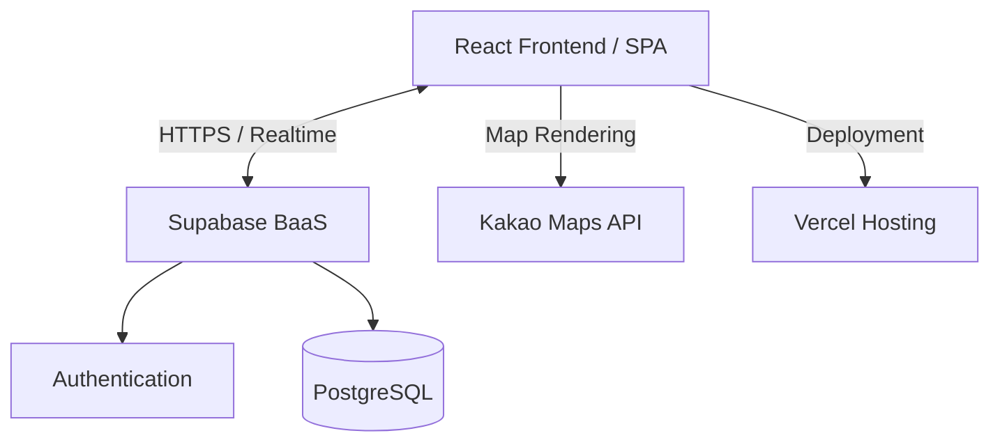

# 개성 맞춤형 듀얼 모드 모바일 청첩장 상세 구현 계획서

본 문서는 **개성 맞춤형 듀얼 모드 모바일 청첩장**의 아키텍처, 기술 스택, 데이터베이스 모델링 및 기능 구현 전략을 담은 기획서입니다.

---

## 1. 아키텍처 및 기술 스택 (Architecture & Tech Stack)

본 프로젝트는 고도의 맞춤형 디자인 인터랙션과 실시간 방명록, 그리고 대시보드 통계 처리를 지원하기 위해 **Serverless Single Page Application (SPA)** 구조로 설계되었습니다.



### 1.1 기술 스택 선정

| 구분 | 기술 스택 | 선정 이유 |
| :--- | :--- | :--- |
| **프레임워크** | React 18 (Vite, TypeScript) | 컴포넌트 기반 구조로 듀얼 모드 UI 재사용성이 뛰어나며, 빠른 번들링과 HMR 지원으로 효율적인 프론트엔드 개발이 가능합니다. |
| **스타일링** | Vanilla CSS (CSS Modules) | 프레임워크나 외부 CSS 라이브러리의 무거운 의존성을 배제하고, 기능별 화면 표현을 세밀하게 제어하기 위함입니다. |
| **백엔드/DB** | Supabase (PostgreSQL) | 방명록 작성/조회, 관리자 로그인, 실시간(Realtime) 업데이트 및 접속자 통계 데이터 수집을 별도의 서버 구축 없이 효율적으로 처리하기 위함입니다. |
| **배포 및 CI/CD** | Vercel | GitHub와 연동되어 푸시 시 자동 배포되며, HTTPS 적용, 글로벌 Edge Network 활용, 커스텀 도메인 매핑 및 SSL 인증서 발급이 무료이자 간편합니다. |

---

## 2. 데이터베이스 스키마 및 보안 (Database Schema & Security)

Supabase PostgreSQL 기반으로 방명록 테이블과 방문 통계 테이블을 구성합니다.

### 2.1 테이블 정의 (SQL DDL)

#### 1) 방명록 테이블 (`guestbook`)
하객들이 남기는 축하 메시지를 저장합니다. 삭제 권한은 예비 부부(관리자)에게만 부여됩니다.
```sql
CREATE TABLE guestbook (
    id UUID PRIMARY KEY DEFAULT gen_random_uuid(),
    created_at TIMESTAMP WITH TIME ZONE DEFAULT timezone('utc'::text, now()) NOT NULL,
    writer_name VARCHAR(50) NOT NULL,
    password_hash VARCHAR(100), -- 사용자가 직접 삭제 요청을 하거나 어드민에서 관리할 때 활용
    content TEXT NOT NULL,
    is_hidden BOOLEAN DEFAULT FALSE NOT NULL, -- 어드민에서 숨김 처리 여부
    theme_mode VARCHAR(10) NOT NULL -- 작성 당시 'light' 또는 'dark' 모드였는지 기록
);
```

#### 2) 방문 통계 테이블 (`visit_logs`)
청첩장의 모드 전환 및 일별/주별 접속 통계를 집계하기 위해 로그를 기록합니다.
```sql
CREATE TABLE visit_logs (
    id UUID PRIMARY KEY DEFAULT gen_random_uuid(),
    visited_at TIMESTAMP WITH TIME ZONE DEFAULT timezone('utc'::text, now()) NOT NULL,
    session_id VARCHAR(100) NOT NULL, -- 중복 접속 방지를 위해 localStorage에서 생성한 임시 세션 ID
    theme_mode VARCHAR(10) NOT NULL, -- 진입 시 테마 ('light' or 'dark')
    referrer VARCHAR(255), -- 유입 경로 (카카오톡, 직접 입력 등)
    user_agent TEXT
);
```

### 2.2 보안 및 RLS (Row Level Security) 설정
- **방명록 (`guestbook`)**:
  - `SELECT`: 전체 하객 가능 (단, `is_hidden = false`인 조건만 조회 가능하도록 RLS Policy 설정)
  - `INSERT`: 전체 하객 가능 (익명 글쓰기 지원)
  - `UPDATE`, `DELETE`: 관리자 계정(`auth.uid()`)만 허용
- **방문 통계 (`visit_logs`)**:
  - `INSERT`: 전체 하객 가능 (접속 시 자동 기록)
  - `SELECT`, `UPDATE`, `DELETE`: 관리자 계정만 허용

---

## 3. 모드 상태 관리 및 화면 전환
- **상태 관리**:
  ```typescript
  const [mode, setMode] = useState<'light' | 'dark'>('light');
  ```
  - 초기화 시: `localStorage.getItem('mode')` 확인 -> 없을 경우 시스템 기본 모드(`prefers-color-scheme`) 또는 예비 부부 지정 기본값 적용.
  - 하나의 URL 안에서 공통 shell을 유지하고, `LightModePage`와 `DarkModePage`를 서로 다른 화면 컴포넌트로 전환합니다.
- **전환 애니메이션**:
  - 해/달 전환 버튼 클릭 시, 화면 전체에 리플(Ripple) 또는 페이드 오버레이가 퍼져나가며 두 화면 사이가 자연스럽게 교체되도록 CSS `transition` 적용 (Duration: `0.4s ease`).
  - 전환 중 중복 클릭을 방지하기 위해 `pointer-events: none`을 일시적으로 주입.
  - 색상만 바꾸는 테마 전환이 아니라, 레이아웃과 콘텐츠 밀도까지 다른 두 개의 페이지형 화면을 부드럽게 넘겨주는 구조로 설계합니다.

---

## 4. 핵심 기능 구현 전략 (Feature Implementation Strategy)

### 4.1 핵심 예식 정보 및 달력/디데이
- **일시 표시**: `2026년 10월 18일 일요일 오전 11:00`
- **D-Day 로직**:
  - JavaScript `Date` 객체를 사용하여 예식 일시와의 차이를 계산합니다.
  - 마이너스(-)일 경우 디데이 카운트를 표기하고 당일에는 `D-DAY` 혹은 `WEDDING DAY`로 시각적으로 강조합니다.
- **캘린더 연동**:
  - 구글 캘린더와 애플 캘린더 등록 링크를 제공하여 하객들이 본인의 폰 캘린더에 간편하게 예식을 등록할 수 있도록 돕습니다. (Google Calendar Web Link API 및 `.ics` 파일 다운로드 기능 제공)

### 4.2 지도 연동 (Kakao Maps API)
- **식장**: 서울대학교 교수회관 예식장
- **구현 방식**:
  - Kakao Maps SDK를 비동기식으로 로드 (`react-kakao-maps-sdk` 활용 또는 스크립트 동적 주입).
  - 지도의 마커를 커스텀 웨딩 아이콘으로 커스터마이징.
  - 모바일 하객을 배려하여 **[카카오맵 앱으로 열기]**, **[네이버 지도 앱으로 열기]**, **[티맵 내비게이션 시작]** 버튼을 배치.
  - 모바일 인앱 브라우저에서 지도 터치 시 스크롤이 막히는 현상을 방지하기 위해 지도의 `draggable: false` 및 줌 컨트롤은 기본 비활성화하고, 클릭 시에만 활성화하거나 별도 크게보기 모달을 제공합니다.

### 4.3 연락처 및 전화걸기 / 계좌 복사
- **연락처**:
  - 신랑, 신부, 혼주들의 이름 옆에 수화기 아이콘 배치.
  - 터치 시 `<a href="tel:010-XXXX-XXXX">`를 통해 즉시 통화 연결.
  - 혼주의 경우 `SMS` 링크 `<a href="sms:010-XXXX-XXXX">`도 병행 제공하여 어른들께도 편리하게 연락할 수 있도록 지원.
- **계좌번호 복사**:
  - 신랑, 신부, 양가 혼주별 계좌 정보를 아코디언(Collapse) 형태로 배치하여 필요 시에만 펼쳐보게 설계.
  - **[계좌번호 복사]** 버튼 터치 시 `navigator.clipboard.writeText`를 호출하여 클립보드에 복사.
  - 복사 성공 시 화면 하단에 2초간 유지되는 **[계좌번호가 복사되었습니다]** 토스트 알림 표시.

### 4.4 하객 소통 (방명록)
- **입력 폼**:
  - 작성자명, 내용, 그리고 나중에 개인이 수정/삭제할 때 사용할 간단한 비밀번호(암호) 입력란 제공.
  - 듀얼 모드 전환 시, 방명록도 각 모드에 맞는 전용 컴포넌트 구조로 렌더링합니다.
- **실시간 바인딩**:
  - Supabase의 Realtime 기능을 활용하여 하객이 글을 작성하는 즉시, 화면을 새로고침하지 않아도 다른 하객들의 화면에 방명록 글이 실시간 렌더링되도록 구현.

---

## 5. 청첩장 관리 대시보드 (Admin Dashboard)

예비 부부(신랑/신부)가 청첩장의 상태와 하객들의 피드백을 한눈에 관리하기 위한 공간입니다.

### 5.1 관리자 인증 (Authentication)
- Supabase Auth를 이용하여 특정 계정(신랑/신부 이메일)으로만 로그인할 수 있는 `/admin` 라우트 구축.
- 인증 정보가 없는 사용자가 접근 시 `/admin/login`으로 리다이렉트 처리.

### 5.2 대시보드 주요 기능
- **방명록 모니터링 및 삭제**:
  - 하객이 작성한 메시지 목록을 시간순으로 정렬하여 표시.
  - 비방용, 스팸성 글을 즉시 가리기 위한 `is_hidden` 토글 버튼 제공.
- **접속 통계 시각화**:
  - `visit_logs` 테이블의 데이터를 가공하여 일별 방문자 수 추이 차트 구현 (라이트급 차트 라이브러리 사용 혹은 직접 SVG 바 차트로 경량화 구현).
  - 방문객들의 브라우저 점유율, 모드별 선호 비율(라이트 모드 vs 다크 모드 전환 비율)을 차트로 표현하여 하객들의 반응 및 모드 전환율 추적.

---

## 6. 품질 및 운영 최적화 전략 (Optimization & Delivery)

### 6.1 모바일 인앱 브라우저 호환성 및 크로스 브라우징
- 카카오톡, 라인 등 메신저 링크 클릭 시 열리는 인앱 브라우저는 일반 브라우저(Safari, Chrome) 대비 JS 엔진 구동 및 스타일 지원에 편차가 큽니다.
- 뷰포트 높이 오류(`100vh`가 주소창 때문에 잘리는 현상)를 방지하기 위해 CSS에서 `--vh` 단위를 동적으로 주입하여 모바일 인앱 브라우저 렌더링을 교정합니다.
  ```javascript
  const setVh = () => {
    let vh = window.innerHeight * 0.01;
    document.documentElement.style.setProperty('--vh', `${vh}px`);
  };
  window.addEventListener('resize', setVh);
  setVh();
  ```

### 6.2 미디어 최적화
- 웨딩 사진 및 동영상은 고용량 리소스로 모바일 네트워크 속도에 따라 LCP(Largest Contentful Paint) 저하의 핵심 원인이 됩니다.
- 모든 이미지는 차세대 이미지 포맷인 **WebP**로 인코딩하고, 해상도별 `srcset`을 적용해 모바일 기기에서는 압축률이 높은 최적 해상도 이미지만 가져오도록 설계합니다.
- 배경 동영상의 경우 **WebM** 포맷으로 최적화하고 `playsinline muted loop autoplay` 속성을 주어 모바일에서도 자동 재생이 매끄럽게 이루어지도록 합니다.

### 6.3 배포 파이프라인 및 커스텀 도메인
- GitHub의 `main` 브랜치와 Vercel 호스팅을 연동합니다.
- 예비 부부가 개별 도메인을 구매한 뒤, Vercel 네임서버 설정(또는 CNAME 레코드 추가)을 통해 커스텀 도메인을 매핑합니다.
- `http://` 접속 시 `https://`로 강제 리다이렉트되도록 Vercel 라우팅 규칙(Vercel configuration)을 보장합니다.
